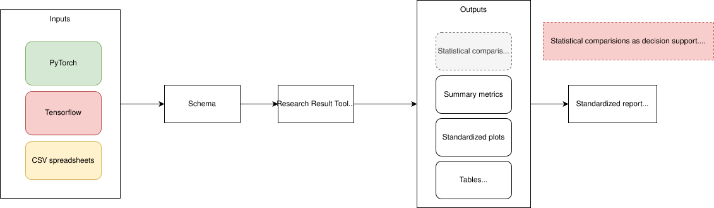

# Research Result Toolkit

[](https://github.com/rocko/research_result_toolkit/actions/workflows/tests.yml)

A small prototype for standardizing how repeated machine-learning experiments are reported, visualized, and statistically compared.

## Scope

This toolkit focuses on a defined set of recurring research-evaluation tasks rather than attempting to cover every possible statistics workflow.
It uses a small common result schema as the boundary between experiment code and analysis. Projects can be implemented in different frameworks or use different internal logging formats, as long as their results are exported into that shared representation.
From there, an evaluation can define the summaries, statistical comparisons, and outputs to be generated consistently across experiments.

## Background

The initial idea emerged from recurring discussions within the working group about how metrics, tables, plots, repeated runs, and statistical tests should be handled.
A shared framework was considered, but no common solution was established at the time. Later publication and thesis work produced several project-specific analysis scripts that highlighted the same underlying need.

This repository consolidates the reusable parts of those scripts into a smaller, more general prototype.


## Installation

```powershell
py -3 -m venv .venv
.venv\Scripts\activate
pip install -r requirements.txt
```

## Conceptual flow

<p align="center">
  
</p>

## Goals

- Define one simple result format independent of PyTorch, TensorFlow, or another training framework.
- Produce consistent summary tables and plots across experiments.
- Provide a small set of common statistical comparisons for repeated runs.
- Make test assumptions and comparison structure explicit instead of hiding them in one-off scripts.
- Allow an evaluation to be defined once and executed consistently.
- Keep the implementation small enough to inspect and review as a group.

## Result schema

The example implementation expects one row per experiment run and metric:

```text
experiment,run,metric,value
baseline,1,accuracy,0.812
baseline,2,accuracy,0.824
method_a,1,accuracy,0.841
method_a,2,accuracy,0.836
```

Additional columns are allowed and preserved. The required columns are:

- `experiment` - experiment or method identifier
- `run` - repeated-run identifier
- `metric` - metric name
- `value` - numeric metric value

This keeps the analysis layer independent from the code that trained the model.

See [`docs/SCHEMA.md`](docs/SCHEMA.md) for the explicit input contract.

## Evaluation definition

An evaluation is a small configuration that defines what should be computed from a result set. It can specify comparisons, statistical tests, multiple-testing correction, and which plots or tables should be generated.

```yaml
name: example_evaluation
data: example_results.csv
output_dir: evaluation_output

comparisons:
  - experiment_a: baseline
    experiment_b: method_a
    metric: f1
    test: wilcoxon
    paired: true

multiple_testing:
  method: holm
  alpha: 0.05

outputs:
  summary_csv: true
  summary_latex: false
  plots:
    - f1
```

Run the example evaluation with:

```text
.\.venv\Scripts\python.exe examples\run_evaluation.py
```

This executes the configured statistical tests, applies the selected multiple-testing correction, writes summary and comparison tables, and generates the requested plots.

## Direct API example

The individual building blocks can also be used directly:

```python
from stats_toolkit import load_results, summarize, compare

results = load_results("examples/example_results.csv")

print(summarize(results))
print(compare(results, "baseline", "method_a", metric="f1"))
```

The original direct demonstration remains available as:

```text
.\.venv\Scripts\python.exe examples\demo.py
```

Run the tests with:

```text
.\.venv\Scripts\python.exe -m pytest
```

## Statistical comparisons

`compare()` supports a deliberately small set of common choices:

- paired t-test
- Wilcoxon signed-rank test
- Welch's t-test
- Mann-Whitney U test
- permutation test for a difference in means

The helper `suggest_test()` can propose candidate tests from the comparison structure, but it is intentionally decision support rather than an automatic statistical authority.

`pairwise_compare()` applies the same comparison across multiple experiments and adjusts the resulting p-values with Holm's method.


## Future work

Potential extensions should be driven by concrete evaluation workflows rather than added speculatively. Candidates include:

- configurable table columns and ordering
- optional integration of statistical-significance results into generated tables
- configurable LaTeX captions and mandatory `\label{...}` generation
- additional reporting options as recurring use cases emerge